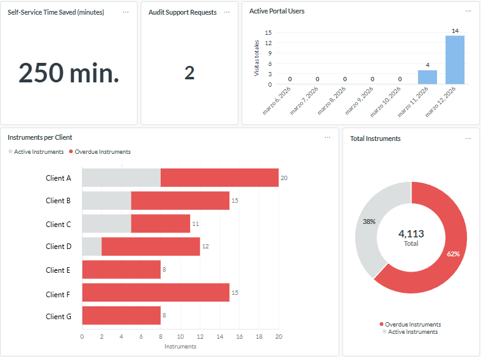
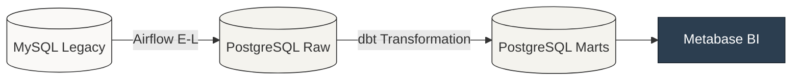

# Automated Operational Analytics Platform

### 1. Executive Summary

**The Problem:** A calibration laboratory operated on a legacy MySQL OLTP database. There were no answers to basic commercial questions, no visibility over operational bottlenecks in the plant, and process audits depended on manual sampling.

**The Solution:** An end-to-end operational analytics platform for laboratory workflows, covering the full data lifecycle — from user event tracking in the frontend to dimensional modeling and final visualization.

**Business Impact:**
* Replaced a 4-hour manual monthly reporting process with a fully automated management dashboard (0 hours).
* Built a continuous observability framework that audits 100% of laboratory workflows daily, ensuring the traceability required by quality standards (ISO 17025).

---

### 2. Business Impact: Operational & Commercial Metrics

The centralized data warehouse serves two main domains through Metabase:

**A. Plant Operations Dashboard**
* **Real Turnaround Time (TAT):** Exact measurement of lead times from equipment entry to customer notification.
* **Bottleneck Detection:** Time spent between specific workstations — for example, the delay between calibration completion and certificate upload.
* **Backlog & Capacity:** Current equipment in the waiting queue, average days per instrument model, and year-over-year volume comparison.

**B. Commercial & Management Dashboard**
* **Portal ROI:** Calculation of administrative time saved based on the volume of self-managed certificate downloads.
* **Commercial Risk:** Tracking of clients with instruments past the calibration due date (>1 year) to trigger proactive sales calls.
* **Digital Adoption:** Active user count and historical login event tracking.

</br>


*Example Operational Dashboard*
>*Note 1: Portal activity tracking was implemented recently. Earlier dates appear as zero because historical user events were not recorded before instrumentation was added to the frontend.*


---

### 3. Analytical Modeling & Process Reconstruction

The main work in this platform is translating raw, append-only events into operational metrics using **dbt**. The project follows a strict Medallion Architecture (Raw → Staging → Intermediate → Marts).

* **Staging:** 1:1 standardization and strict type casting from raw sources.
* **Intermediate:** Resolves complex logic — temporal state pivoting, deduplication from the append-only source, and portal visit sessionization using window functions.
* **Marts:** Fact and dimension tables optimized for BI consumption. The grain is one row per laboratory service order, including its final metrological state and calculated lead times.

<details>
<summary><b>View Code: Unit Testing Pivot Logic</b></summary>

<br>

The unit test below validates a non-obvious edge case: when a rework cycle sends an order back through calibration, the model must capture the *first* calibration timestamp, not the most recent one. This ensures traceability rules are met.

```yaml
# models/intermediate/_int_unit_tests.yml
unit_tests:
  - name: test_int_ordenes_pivoted_rework_cycles
    model: int_ordenes_pivoted
    given:
      - input: ref('stg_cambios_estados_ordenes')
        rows:
          - {id_orden: 1, id_estado: 1, fecha_cambio: '2026-01-01 10:00'}
          - {id_orden: 1, id_estado: 3, fecha_cambio: '2026-01-01 12:00'} # Calibrated
          - {id_orden: 1, id_estado: 2, fecha_cambio: '2026-01-01 13:00'} # Rework
          - {id_orden: 1, id_estado: 3, fecha_cambio: '2026-01-01 15:00'} # Re-Calibrated
    expect:
      rows:
        - id_orden: 1
          ts_ingresado: '2026-01-01 10:00'
          ts_calibrado: '2026-01-01 12:00' # Must pick the FIRST calibration
```

</details>

---

### 4. Platform Architecture



* **Shift-Left Data Instrumentation:** Telemetry code added directly in the PHP frontend to log user events into the operational database.
* **Immutable Ingestion:** Append-only pattern in Airflow — new states are appended with an `_ingested_at` timestamp. This preserves the historical record needed to reconstruct past events during external audits.
* **On-Premise Deployment:** Full stack orchestrated with Docker Compose on internal servers, required by the laboratory's data residency policy.

<details>
<summary><b>View Code: Airflow Ingestion & Audit Persistence</b></summary>

<br>

The ingestion script includes a self-healing block. After each dbt run, an Airflow task parses the `run_results.json` artifact and writes all test failures to a dedicated `audit` schema.

```python
def process_dbt_results(json_path, pg_uri):
    """
    Parses dbt artifacts and persists validation results into the audit schema.
    """
    with open(json_path, 'r') as f:
        data = json.load(f)

    alerts = []
    for result in data['results']:
        if result['status'] in ['warn', 'fail']:
            clean_name = result['unique_id'].split('.')[-2] if '.' in result['unique_id'] else result['unique_id']
            alerts.append({
                'test_id': clean_name,
                'status': result['status'],
                'error_message': result['message'],
                'executed_at': data['metadata']['generated_at']
            })

    if audit_records:
        df = pd.DataFrame(audit_records)
        engine = create_engine(POSTGRES_URI)
        # Persistent log of quality breaches
        df.to_sql(
            'audit_log', 
            engine, 
            schema='audit', 
            if_exists='append', 
            index=False
        )
```

</details>

---

### 5. Data Observability & Case Study

The framework uses a 4-phase testing strategy in dbt (Freshness, Generic, Unit, and Singular tests). Custom SQL singular tests act as automated logic auditors. If a test returns rows, a non-conformity is flagged.

**Case Study: Hybrid Resolution for Workflow Anomalies**

During an internal manual audit, the quality manager found two issues: a technician calibrating and approving their own work (conflict of interest in segregation of duties), and specific orders showing repeated chronological states without explanation.

The resolution followed the logic of where each problem originated:

1. **Application Logic (Prevention):** A strict validation was added in the PHP backend to block users from approving certificates they created. The problem had a clear cause and a clear fix — it belonged in the transactional system.
2. **Data Observability (Passive Monitoring):** The origin of the duplicated states was unclear — a silent bug somewhere in the application. Rather than guessing, a singular test (`warn_estados_duplicados_consecutivos.sql`) was built into the dbt project. The data warehouse now flags this anomaly daily across 100% of the database until the root cause is found and patched.

The underlying principle: what can be prevented gets blocked at the source. What requires ongoing monitoring gets delegated to the observability layer.

<details>
<summary><b>View Code: Singular Test for Duplicate States</b></summary>

```sql
-- tests/warn_estados_duplicados_consecutivos.sql
-- Detect consecutive duplicate states in the order workflow timeline.

{{ config(severity = 'warn') }}
with state_sequence as (
    select 
        id_orden,
        id_estado,
        fecha_cambio,
        lag(id_estado) over (
            partition by id_orden 
            order by fecha_cambio asc, id_cambio_estado asc
        ) as previous_state
    from {{ ref('stg_cambios_estados_ordenes') }}
)
select 
    id_orden,
    id_estado as duplicated_state,
    fecha_cambio

from state_history
where id_estado = previous_state
```

</details>

---

### 6. Repository Structure

```text
analytics-platform/
├── airflow/
│   └── dags/
│       └── main_pipeline_dag.py          # Orchestration: E-L, dbt run & audit persistence
│
├── dbt/
│   ├── models/
│   │   ├── staging/
│   │   │   ├── stg_ordenes.sql
│   │   │   └── _stg_models.yml
│   │   │
│   │   ├── intermediate/
│   │   │   ├── int_ordenes_pivoted.sql
│   │   │   └── _int_unit_tests.yml
│   │   │
│   │   └── marts/
│   │       └── fct_ordenes.sql
│   │
│   ├── tests/
│   │   └── warn_estados_duplicados_consecutivos.sql
│   │
│   ├── dbt_project.yml
│   └── profiles.yml
│
├── Dockerfile                           # Container build for orchestration environment
├── requirements.txt                     # Python dependencies (Airflow / dbt integration)
├── docker-compose.yml                   # Full platform orchestration
├── .env.example                         # Environment variable template
├── .gitignore
│
└── README.md
```