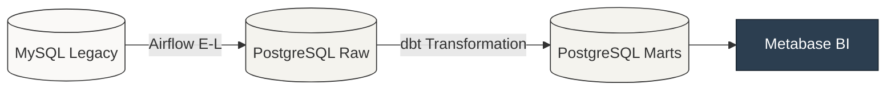
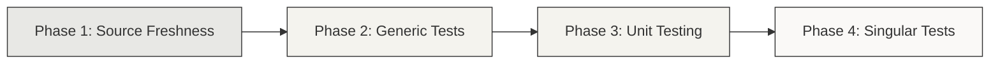

# ISO 17025 Compliance & Data Observability Framework

### Project Objective
The primary objective of this project was the migration of transactional data from a legacy MySQL environment to a centralized analytical Data Warehouse based on PostgreSQL. This transition facilitates the calculation of business-critical KPIs and establishes an automated auditing framework specifically designed to satisfy the requirements of the **ISO 17025** quality standard.

---

### 1. Context and Business Problem
The laboratory’s operations were managed through an OLTP database (MySQL) optimized for daily record-keeping but limited in its analytical capabilities. This setup presented two significant challenges for the organization:

1.  **Visibility Gaps:** Management lacked a clear view of real-time lead times per instrument, making it difficult to identify and resolve logistical bottlenecks without extensive manual intervention.
2.  **Compliance Vulnerabilities (ISO 17025):** The original system lacked sufficient controls to prevent human errors that directly conflicted with quality standards. Examples included technicians approving their own certificates or the presence of records with inconsistent timestamps.

To address these issues, the decision was made to decouple the analytical layer from the operational system. By building a dedicated **OLAP environment with integrated data observability**, we ensured that compliance monitoring is automated, providing a reliable "Audit Trail" for technical management.


---

### 2. Technical Architecture
The entire stack is orchestrated locally using **Docker Compose**, maintaining an on-premise setup to comply with the laboratory's security and data privacy requirements.

#### Data Pipeline Overview

</br>

*   **Extraction & Loading (E-L):** **Apache Airflow** manages batch ingestion using Python (SQLAlchemy/Pandas). The process follows an **Append-only** pattern, adding a technical metadata column (`_ingested_at`) to every record to ensure a permanent audit trail. The ingestion script includes a **self-healing** block that automatically verifies and updates the target schema to guarantee metadata persistence.
</br>

*   **Transformation (T):** **dbt (Data Build Tool)** handles the logic within PostgreSQL across three structured layers:
    *   `staging/`: Standardizes naming conventions and enforces strict type casting.
    *   `intermediate/`: This layer acts as the primary logic refinery. It handles **state deduplication** (selecting the most recent record from the append-only source), temporal pivoting of states, and window functions for logistical matching.
    *   `marts/`: Final presentation using a **Star Schema (Kimball)**. It exposes dimensions (`dim_instrumentos`) and fact tables (`fct_ordenes`) optimized for analytical consumption in Metabase.

---

### 3. Transformation Strategy: dbt as a Governance Tool
The transition from traditional SQL views to a **dbt-led Analytics Engineering workflow** was executed to satisfy the rigorous audit requirements of ISO 17025. This choice is based on three fundamental pillars:

*   **Automated Quality Gates:** The framework utilizes dbt’s testing engine to establish mandatory validation layers. While generic tests ensure structural integrity, **singular tests** function as automated auditors that flag "Non-Conformities" (e.g., unauthorized certificate approvals), preventing compromised data from reaching the final dashboards.
*   **Verifiable Data Lineage:** Through the use of `ref()` functions and auto-generated documentation, the system maintains a transparent **Audit Trail**. This ensures that every KPI is fully traceable to its raw source, providing the technical evidence required during accreditation assessments.
*   **Mathematical Modularization:** Complex metrological logic—such as the calculation of net latency between state transitions—is isolated into independent models. This modular approach simplifies the validation of transformations and minimizes the risk of calculation errors in the long-term maintenance of the warehouse.


---

### 4. Data Quality Framework (ISO 17025)
Data reliability is the cornerstone of a regulated laboratory. To ensure technical validity and regulatory compliance, a **4-phase automated validation strategy** was implemented as a quality gate to protect data integrity before it reaches the analytical layer.



#### Phase 1: Source Freshness (Latency Control)
This phase monitors ingestion latency to prevent decision-making based on stale data. The system is configured to trigger a failure if raw data exceeds a 72-hour window, providing a buffer for non-working weekends while ensuring that reporting remains compliant with operational requirements.

>**Implementation Detail:** This control is enforced via `dbt source freshness` within the Airflow DAG. If the command detects an error state, downstream transformation tasks are automatically halted to preserve the integrity of the analytical models.

</br>
<details open>
    <summary style="cursor:pointer"><strong>Code snippet:</strong>
    </summary>

```yaml
# models/staging/src_centec.yml
sources:
  - name: centec_raw
    tables:
      - name: cambios_estados_ordenes
        loaded_at_field: fecha_cambio
        freshness:
          warn_after: {count: 48, period: hour}
          error_after: {count: 72, period: hour}
```
</details>
<br>

#### Phase 2: Structural Integrity (Generic Tests)
Standardized schema validations are applied across all architecture layers to enforce data contracts and prevent orphaned records. These tests act as the first line of defense against structural inconsistencies.

>**Implementation Detail:** Validations are strategically distributed: `unique` and `not_null` at the Staging layer to sanitize the entry point; `accepted_values` at the Intermediate layer to govern the business logic of state transitions; and `referential integrity (relationships)` at the Marts layer to guarantee the consistency of the Star Schema.

</br>
<details>
    <summary style="cursor:pointer"><strong>Code snippet:</strong>
    </summary>
    
```yaml
# Simplified validation schema across layers
models:
- name: stg_ordenes
    columns:
    - name: id_orden
        tests: [unique, not_null]

- name: int_ordenes_pivoted
    columns:
    - name: id_estado_actual
        tests:
        - accepted_values:
            values: # Authorized ISO 17025 workflow states

- name: fct_ordenes
    columns:
    - name: id_instrumento
        tests:
        - relationships:
            to: ref('dim_instrumentos')
            field: id_instrumento
```
</details>
<br>


#### Phase 3: Logic Validation (Unit Testing)
This phase utilizes **dbt 1.8+ unit tests** to verify complex SQL transformations against static mock data. The primary objective is to ensure the "transformation engine" is mathematically sound and compliant with ISO 17025 protocols before it interacts with production data.

>**Implementation Detail:** The framework decouples logic from the database state by simulating **edge cases**, such as duplicated state entries or non-linear rework cycles. This ensures the model consistently identifies the correct timestamps, such as the initial calibration event, regardless of subsequent system entries.

</br>
    <details open>
    <summary style="cursor:pointer"><strong>Code snippet:</strong>
    </summary>

```yaml
# models/intermediate/_int_unit_tests.yml
unit_tests:
  - name: test_int_ordenes_pivoted_rework_cycles
    model: int_ordenes_pivoted
    given:
      - input: ref('stg_cambios_estados_ordenes')
        rows:
          - {id_orden: 1, id_estado: 1, fecha_cambio: '2026-01-01 10:00'}
          - {id_orden: 1, id_estado: 3, fecha_cambio: '2026-01-01 12:00'} # Calibrated
          - {id_orden: 1, id_estado: 2, fecha_cambio: '2026-01-01 13:00'} # Back to Process (Rework)
          - {id_orden: 1, id_estado: 3, fecha_cambio: '2026-01-01 15:00'} # Re-Calibrated
    expect:
      rows:
        - id_orden: 1
          ts_ingresado: '2026-01-01 10:00'
          ts_calibrado: '2026-01-01 12:00' # Must pick the FIRST calibration per ISO protocol
```
</details>
<br>

#### Phase 4: Compliance Auditing (Singular Tests)
Custom SQL scripts function as **automated ISO 17025 auditors**. These tests extend beyond standard schema validation to enforce physical and regulatory constraints directly within the analytical layer.

>**Implementation Detail:** These scripts, located in the `/tests` directory, are designed to identify **Non-Conformities (NCs)**. If a query returns a result—for example, a violation of the segregation of duties where a technician approves their own work—the test fails, automatically flagging a breach in the laboratory’s quality protocol.

</br>
    <details open>
    <summary style="cursor:pointer"><strong>Code snippet:</strong>
    </summary>

```sql
-- tests/test_iso_17025_conflict_of_interest.sql
-- Goal: Ensure segregation of duties between calibration and approval.
select
    id_orden,
    user_calibrado,
    user_aprobado
from {{ ref('fct_ordenes') }}
where user_calibrado = user_aprobado
  and user_calibrado is not null
```
</details>
<br>

---

### 5. Data Observability & Audit Persistence
Beyond validation, the framework establishes a continuous feedback loop for technical management. This ensures that the **Audit Trail** required by ISO 17025 is not only generated but also preserved as a permanent record.

*   **Metadata Extraction:** After each execution, an Airflow task parses the `run_results.json` artifact generated by dbt. This process extracts the status of every quality gate, including specific error messages and execution timestamps.
*   **Persistent Audit Schema:** Results from failed tests and warnings are persisted into a dedicated `audit` schema in PostgreSQL. Using an **append-only** strategy for these logs ensures that a historical record of system compliance is available for future inspections.
*   **Managerial Dashboards:** This data is visualized via Metabase, translating technical execution logs into auditable evidence. This enables the Technical Manager to perform a **Root Cause Analysis (RCA)** on operational failures or non-conformities without direct interaction with the code or the orchestration logs.

    </br>
    <details>
    <summary style="cursor:pointer"><strong>Implementation Detail (Audit Parser):</strong></summary>

    ```python
    def process_dbt_results(json_path, pg_uri):
        """
        Parses dbt artifacts and persists validation results into the audit schema.
        """
        with open(json_path, 'r') as f:
            data = json.load(f)
        
        alerts = []
        for result in data['results']:
            if result['status'] in ['warn', 'fail']:
                clean_name = result['unique_id'].split('.')[-2] if '.' in result['unique_id'] else result['unique_id']
                
                alerts.append({
                    'test_id': clean_name,
                    'status': result['status'],
                    'error_message': result['message'],
                    'executed_at': data['metadata']['generated_at']
                })
        
        if alerts:
            df = pd.DataFrame(alerts)
            engine = create_engine(pg_uri)
            # Maintained as append-only to support long-term compliance records
            df.to_sql('audit_log', engine, schema='audit', if_exists='append', index=False)
    ```
    </details>
    <br>

---

### 6. Engineering Decisions & Trade-offs
The design of this architecture was guided by a pragmatic assessment of the laboratory's operational reality and regulatory constraints:

*   **Full Refresh over Incremental:** Given the current data scale (thousands of records), a **Full Refresh** strategy was prioritized. This approach minimizes architectural complexity and significantly reduces the maintenance overhead, providing optimal performance without the risks associated with managing complex incremental logic in a low-volume environment.
*   **On-Premise Infrastructure:** Deployment via **Docker Compose** on internal servers was a mandatory requirement. Cloud-native architectures were discarded to ensure total data residency, complying with strict laboratory network policies regarding the confidentiality of metrological information.
*   **Batch Processing:** Ingestion and transformation cycles are scheduled in batches. For the current requirements of lead-time analysis and logistical bottleneck identification, the resulting latency is well within operational needs. Implementing real-time streaming (e.g., Kafka) was considered an unnecessary complication that would add risk without adding business value.

---

### 7. Project Structure
```text
iso-data-observability-dw/
├── airflow/
│   └── dags/                # DAG definitions (dag_olap.py)
├── dbt_centec/
│   ├── macros/              # Reusable SQL snippets
│   ├── models/
│   │   ├── staging/         # Renaming and type casting
│   │   ├── intermediate/    # Complex business logic (Pivoting/Aggregations)
│   │   └── marts/           # Presentation layer (Star Schema)
│   ├── tests/               # Singular business tests (ISO 17025 Audit)
│   ├── dbt_project.yml      # dbt project configuration
│   └── profiles.yml.example # Connection template (Redacted)
├── docker-compose.yml       # Full stack orchestration
└── README.md
```

---

#### Repository Content

This repository is a **technical showcase** of the project's architecture and core logic. While the full environment is hosted on-premise, the following key files are included to demonstrate the implementation:

* **Core Transformation:** `models/intermediate/int_ordenes_pivoted.sql` (Complex state pivoting logic).
* **Dimensional Model:** `models/marts/core/fct_ordenes.sql` (Final Star Schema implementation).
* **Quality Assurance:** `models/intermediate/_int_unit_tests.yml` (Unit testing for edge case validation).
* **Configuration:** `dbt_project.yml` (Project standards and materializations).


